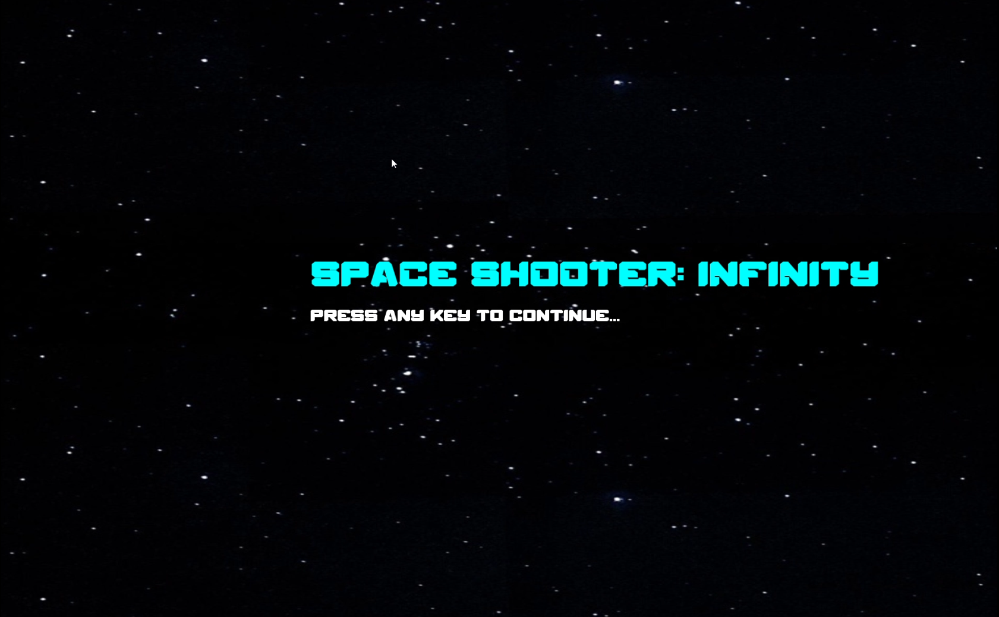
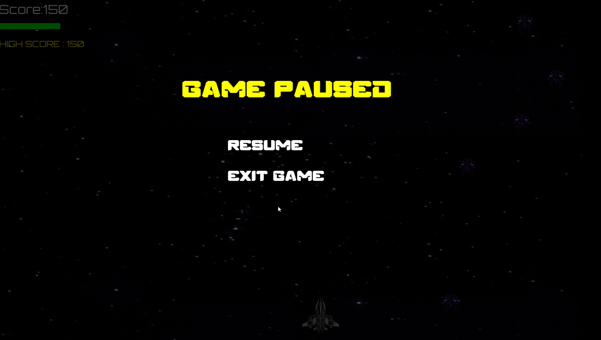
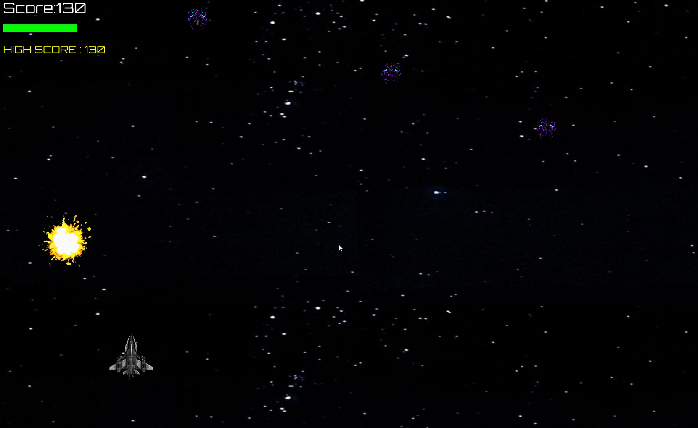
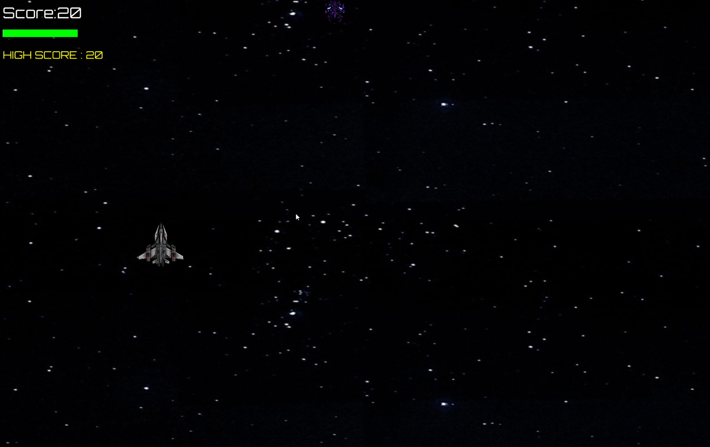

# 🎯 Space Shooter: Infinity

This is a fast-paced **2D arcade-style space shooter game** developed using **C++** and **SFML**.This project demonstrates multiple core mechanics of **2D game development**,including:

* Dynamic scrolling backgrounds
* Enemy spawning systems
* Collision handling
* Health & score systems
* Audio integration
* Pause state management
* Progressive difficulty scaling
---

# 🧠 Features:

* 🚀 Smooth player movement system
* 🔫 Bullet shooting mechanics
* 👾 Randomized enemy spawning
* 💥 Explosion animations & sound effects
* ❤️ 3-Level player health system
* 🏆 High score tracking system
* 📈 Progressive difficulty scaling
* 🔄 Re-play system after Game Over
* 🌌 Infinite scrolling space background
* ✨ Animated UI transitions
* 🖥️ Fullscreen mode support (F11 toggle)
* ⏸️ Animated pause menu system
* 🎮 Interactive main menu interface
* 🎵 Dynamic background music
* 🔫 Shooting sound effects
* 💥 Explosion audio effects
* 🚀 Thruster movement sound
* 🖱️ Hover & click UI sounds
---

# 📚 Primary SDKs / Libraries:

* **C++17 Compatible Compiler**
* **SFML 2.6+**
* **Visual Studio 2022** *(Main IDE)*

---

# 💻 Supported Platforms:

* Windows (Tested)
* macOS

---

# ⚙️ Additional Requirements:

* Proper SFML DLL setup
* Terminal / PowerShell / Command Prompt
* GitHub Desktop *(optional for cloning)*

---

# 📥 How to Clone the Project (via GitHub Desktop):

1. Open **GitHub Desktop**
2. Click:

```text
Current Repository → Add → Clone Repository
```

3. Open the **URL** tab
4. Paste the repository link:

```text
https://github.com/JoyIsHere001/2D_Space_Shooter
```

5. Choose a local directory
6. Click **Clone** ✅

---

# ▶️ Running the Project via Visual Studio:

## Step 1:

Open the cloned project folder.

## Step 2:

Open the `.sln` file using:

```text
Visual Studio 2022
```

## Step 3:

Ensure SFML is correctly linked.

## Step 4:

Build the solution:

```text
Build → Build Solution
```

## Step 5:

Run the game:

```text
Ctrl + F5
```

---

# ▶️ Running the Project via Terminal:

## Navigate to the project directory:

```bash
cd "C:\Users\<your-username>\Documents\GitHub\2D_Space_Shooter"
```

---

## Compile using g++:

```bash
g++ main.cpp Game.cpp HUD.cpp -o SpaceShooter ^
-I"C:\SFML\include" ^
-L"C:\SFML\lib" ^
-lsfml-graphics ^
-lsfml-window ^
-lsfml-system ^
-lsfml-audio
```

---

## Run the executable:

```bash
SpaceShooter.exe
```

---

# 🎮 Default Controls:

| Key              | Action            |
| ---------------- | ----------------- |
| ⬅️ ➡️ ⬆️ ⬇️    | Move Player       |
| SPACE            | Shoot             |
| ESC              | Pause / Resume    |
| F11              | Toggle Fullscreen |

---

# 🏆 Gameplay Aspects:

* 👾 Destroying enemies grants **10 score points**
* ❤️ Player starts with **3 health units**
* 💥 Enemy collision reduces health by **1 unit** 
* 📈 Enemy count and spawn rate increase over time
* ⚡ Gameplay progressively becomes harder

---
# 🖼️ Sample Gameplay:

## 🎮 Main Menu



---

## 🚀 Gameplay Action



---

## 💥 Explosion & Combat



---

## ⏸️ Pause Menu



# 🔧 Technical Highlights:

* Object-Oriented Programming (OOP)
* Modular game-state architecture
* Optimized collision handling
* Reusable audio system
* Dynamic enemy management
* Real-time rendering loop
* Frame-independent movement system
* Beginner-friendly project structure

---

# 📚 Learning Mechanics:

This project is useful for learning:

* Game loops
* Delta time
* Collision systems
* Real-time rendering
* Audio integration
* State machines
* Animation systems
* HUD systems
* Event handling in SFML

---

# 🤝 Contributions:

## 👨‍💻 Lead Programmer & Designer

### Joysurya Paul Chowdhury (Author)

### Contributions:

* Core gameplay development
* Player movement & shooting mechanics
* Main menu & pause menu system
* Audio integration
* Collision handling
* Explosion effects system
* Health & score mechanics
* Background scrolling system
* Overall game architecture & design

GitHub:
https://github.com/JoyIsHere001

Linkedin:
https://www.linkedin.com/in/joysurya-paul-chowdhury-251575390?utm_source=share_via&utm_content=profile&utm_medium=member_android

Email:
js4677294@gmail.com

---

## 👨‍💻 Assistant Programmer

### Subham Sarkar (Data Scientist / 2nd year BSc. honours student / Computer Science)

### Contributions:

* Enemy spawning system
* In-game HUD system
* Game optimization
* Play testing & gameplay balancing

GitHub:
https://github.com/complexsubh8

Linkedin:

Email:

---

# ⭐ Support the Project

If you liked this project, consider giving it a ⭐ on GitHub!

---
